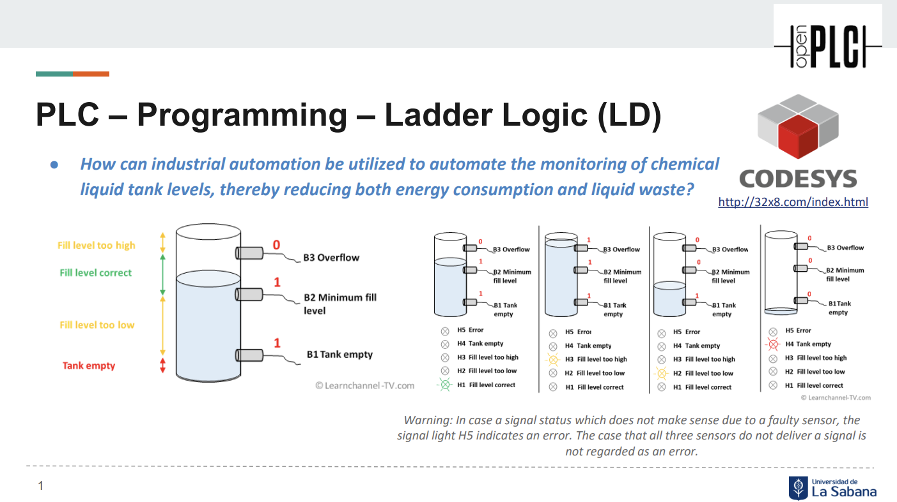
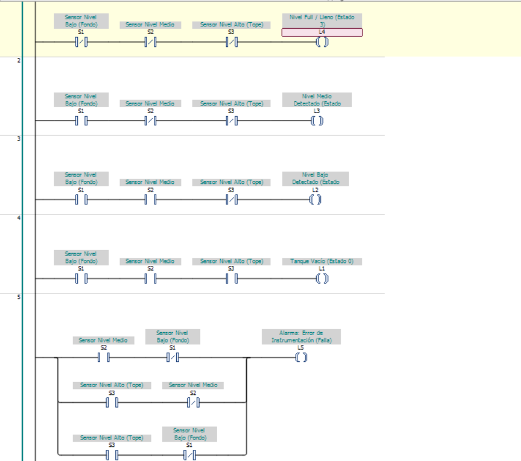
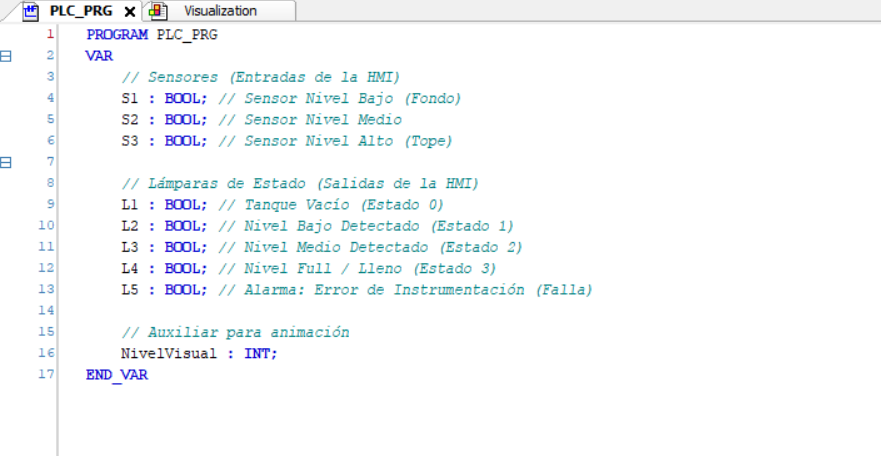

Trabajo Hecho por Jorge Enrique Lugo Lopez.

# Monitoreo de Niveles en Tanque de Líquidos Químicos
## Proyecto de Automatización Industrial - Control Combinacional con CODESYS y OpenPLC

Este proyecto implementa un sistema de monitoreo de nivel para tanques químicos utilizando una arquitectura de control combinacional. La solución integra una interfaz **HMI** en CODESYS, lógica de control en **Ladder (IEC 61131-3)** y validación física mediante un **Arduino Uno** actuando como esclavo de I/O para **OpenPLC**.

---

## 1. Diseño Lógico (Control Combinacional)

El sistema utiliza tres sensores digitales ($S_1, S_2, S_3$) para determinar el estado del tanque. Se diseñó una lógica robusta que incluye la detección de fallos de instrumentación para garantizar la seguridad funcional del proceso.

### Tabla de Verdad del Sistema

| $S_3$ (Alto) | $S_2$ (Medio) | $S_1$ (Bajo) | Estado del Proceso | Salida Activa |
| :---: | :---: | :---: | :--- | :---: |
| 0 | 0 | 0 | Tanque Vacío | $L_1$ (Blanco/Gris) |
| 0 | 0 | 1 | Nivel Bajo Alcanzado | $L_2$ (Naranja) |
| 0 | 1 | 1 | Nivel Medio Alcanzado | $L_3$ (Amarillo) |
| 1 | 1 | 1 | Tanque Lleno (Full) | $L_4$ (Verde) |
| **X** | **X** | **X** | **Inconsistencia Física** | $L_5$ (Rojo - Error) |

> **Nota de Ingeniería:** Las combinaciones marcadas con **X** representan estados físicamente imposibles (ej. sensor superior activo sin el inferior), los cuales disparan la alarma de error $L_5$.

### Ecuaciones Booleanas
- **Vacío ($L_1$):** $\overline{S_1} \cdot \overline{S_2} \cdot \overline{S_3}$
- **Nivel Bajo ($L_2$):** $S_1 \cdot \overline{S_2} \cdot \overline{S_3}$
- **Nivel Medio ($L_3$):** $S_1 \cdot S_2 \cdot \overline{S_3}$
- **Tanque Lleno ($L_4$):** $S_1 \cdot S_2 \cdot S_3$
- **Alarma de Error ($L_5$):** $(\overline{S_1} \cdot S_2) + (\overline{S_2} \cdot S_3) + (\overline{S_1} \cdot S_3)$

---

## 2. Implementación en CODESYS (HMI)

Se desarrolló una interfaz hombre-máquina (HMI) para simular el comportamiento del tanque. 

**Lógica Ladder:**
La implementación en diagrama de contactos sigue estrictamente las ecuaciones booleanas, utilizando contactos normalmente abiertos/cerrados para representar las entradas y bobinas para las salidas.

---

## 3. Configuración de Hardware (Arduino + OpenPLC)

Para la validación física, se utilizó un **Arduino Uno** configurado como hardware de campo.

### Pasos de Configuración:
1. **Firmware:** Se utilizó el entorno de OpenPLC para cargar el archivo `OpenPLC_Uno.ino` al microcontrolador.
2. **Personalización de Pines:** Se editaron las definiciones de los pines en el código fuente para alinear los registros de entrada (`%IX`) y salida (`%QX`) con el cableado físico.
3. **Mapeo de I/O:**
   - **Sensores:** Entradas digitales configuradas con resistencias de Pull-Down.
   - **Indicadores:** LEDs conectados a salidas digitales con resistencias limitadoras de corriente.

*(Pega aquí la foto de tu Arduino cableado: ``)*

---

## 4. Validación y Pruebas

Se realizaron pruebas de campo forzando estados lógicos inconsistentes para validar la activación de la alarma $L_5$. El sistema demostró un tiempo de respuesta óptimo y una sincronización precisa entre la HMI y el hardware real.

---

## Demo en Video
Puedes ver la demostración completa del funcionamiento [aquí (Insertar link de YouTube/Teams)].
